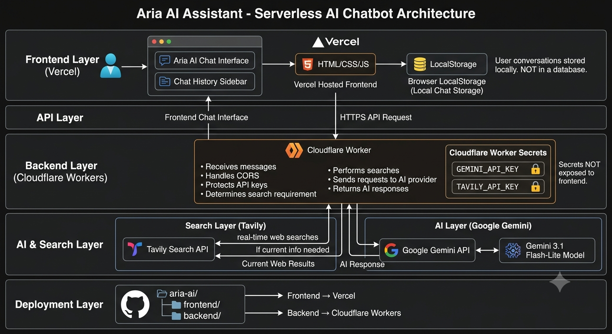

# Aria AI Assistant

Aria AI Assistant is a serverless, privacy-focused AI chatbot powered by Google Gemini and Tavily Search.

Aria provides intelligent AI responses and real-time web search capabilities through a lightweight frontend hosted on Vercel and a secure backend running on Cloudflare Workers.

## Features

- AI-powered conversations using Google Gemini
- Real-time web search using Tavily Search
- Serverless architecture
- Frontend hosted on Vercel
- Backend hosted on Cloudflare Workers
- Client-side chat history using browser LocalStorage
- No backend database for storing conversations
- API keys securely stored as Cloudflare Worker Secrets
- CORS protection
- Lightweight HTML, CSS, and JavaScript frontend

## System Architecture


```text
                         ┌─────────────────────────────┐
                         │   Frontend Layer (Vercel)   │
                         │   HTML / CSS / JavaScript   │
                         └──────────────┬──────────────┘
                                        │
                                        │ HTTPS API Request
                                        ▼
                         ┌─────────────────────────────┐
                         │ Backend (Cloudflare Worker) │
                         │                             │
                         │ - CORS Policy               │
                         │ - API Key Security          │
                         │ - Request Routing           │
                         │ - Search Logic              │
                         └──────┬───────────────┬──────┘
                                │               │
                ┌───────────────┘               └───────────────┐
                │                                               │
                │ Real-Time Search                              │ AI Request
                ▼                                               ▼
       ┌─────────────────────┐                         ┌─────────────────────┐
       │ Search Layer        │                         │ AI Layer            │
       │                     │                         │                     │
       │ Tavily Search API   │                         │ Google Gemini API   │
       └─────────────────────┘                         └─────────────────────┘
```

## Architecture

The application is divided into four main layers.

### 1. Frontend Layer

The frontend is a static HTML, CSS, and JavaScript application hosted on Vercel.

It provides:

- Chat interface
- Chat history sidebar
- User interaction
- API communication with the backend

Chat history is stored in the browser using LocalStorage. No external database is used to store user conversations.

### 2. Backend Layer

The backend runs as a Cloudflare Worker and acts as a secure API gateway between the frontend and external services.

The Worker handles:

- CORS policy
- Incoming API requests
- API key protection
- Request routing
- Search requirements
- Communication with Gemini and Tavily

This prevents sensitive API credentials from being exposed in the frontend.

### 3. AI and Search Layer

#### Tavily Search

Tavily Search is used when current or real-time web information is required.

The Cloudflare Worker sends search requests to Tavily and processes the returned information.

#### Google Gemini

Google Gemini is used to generate AI responses.

The application uses the Gemini 3.1 Flash-Lite model for response generation.

### 4. Deployment Layer

The project uses a monorepo structure.

The frontend and backend are deployed independently:

- Frontend → Vercel
- Backend → Cloudflare Workers

## Privacy

Aria is designed with a privacy-focused architecture.

User conversations are stored locally in the browser using LocalStorage rather than being persisted in a backend database.

API credentials are not stored in the frontend. Sensitive keys such as:

```text
GEMINI_API_KEY
TAVILY_API_KEY
```

are stored as Cloudflare Worker Secrets.

## Project Structure

```text
aria-ai/
│
├── frontend/
│   ├── index.html
│   ├── style.css
│   └── script.js
│
└── backend/
    ├── src/
    │   └── index.js
    └── wrangler.toml
```

## Technologies

### Frontend

- HTML
- CSS
- JavaScript
- Vercel

### Backend

- Cloudflare Workers
- Cloudflare Worker Secrets
- JavaScript

### AI and Search

- Google Gemini API
- Tavily Search API

## Deployment

### Frontend

The `/frontend` directory can be deployed to Vercel.

### Backend

The `/backend` directory can be deployed to Cloudflare Workers using Wrangler.

API credentials should be configured as Cloudflare Worker Secrets rather than being included in the source code.

## Environment Secrets

The backend requires the following secrets:

```text
GEMINI_API_KEY
TAVILY_API_KEY
```

These should be configured in the Cloudflare Worker environment.

Do not commit API keys to the repository.

## How It Works

1. The user sends a message through the frontend.
2. The frontend sends the request to the Cloudflare Worker.
3. The Worker determines whether web search is required.
4. If search is required, the Worker requests current information from Tavily.
5. The Worker sends the relevant information and user request to Gemini.
6. Gemini generates the response.
7. The Worker returns the response to the frontend.
8. The frontend displays the response to the user.
9. Chat history is stored locally in the user's browser.
